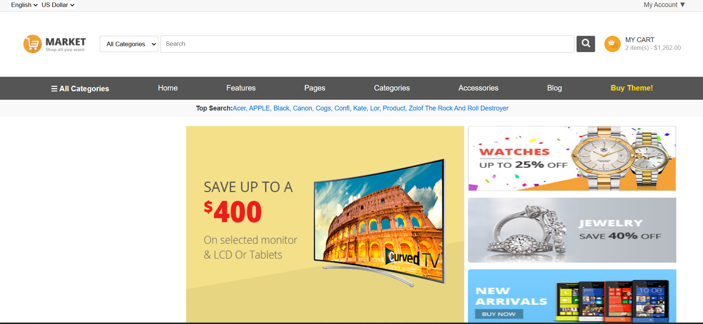
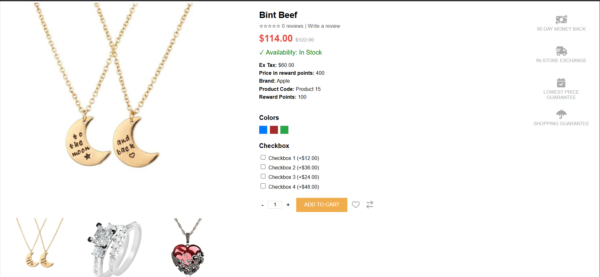
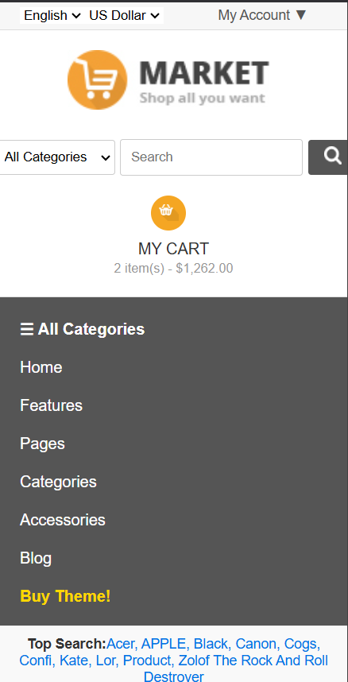

# 🛒 E-Commerce Website

A **fully responsive** e-commerce website built with **React Vite, Redux Toolkit, and React Router DOM**. The application provides seamless shopping experiences across desktop and mobile screens, ensuring **fast performance, dynamic product pages, and an intuitive UI**.

## 📸 Screenshots







## 🚀 Features

- **Fully Responsive** – Works smoothly on desktop, tablet, and mobile screens.
- **React Vite** – Ensures fast performance and quick build times.
- **Redux Toolkit** – Efficient global state management for cart and product data.
- **React Router DOM** – Enables dynamic routing for seamless navigation.
- **Persistent Cart** – Stores cart data using local storage.
- **Modern UI** – Aesthetic and user-friendly interface.

## 🛠️ Tech Stack

- **Frontend:** React, Redux Toolkit, React Router DOM, Tailwind CSS
- **State Management:** Redux Toolkit
- **Package Manager:** npm / yarn

## Installation
Follow these steps to set up and run the project locally:

1. Clone the repository:
   ```bash
   git clone https://github.com/your-username/your-repo-name.git
   cd your-repo-name
   ```

2. Install dependencies:
   ```bash
   npm install
   ```

3. Start the development server:
   ```bash
   npm run dev
   ```
